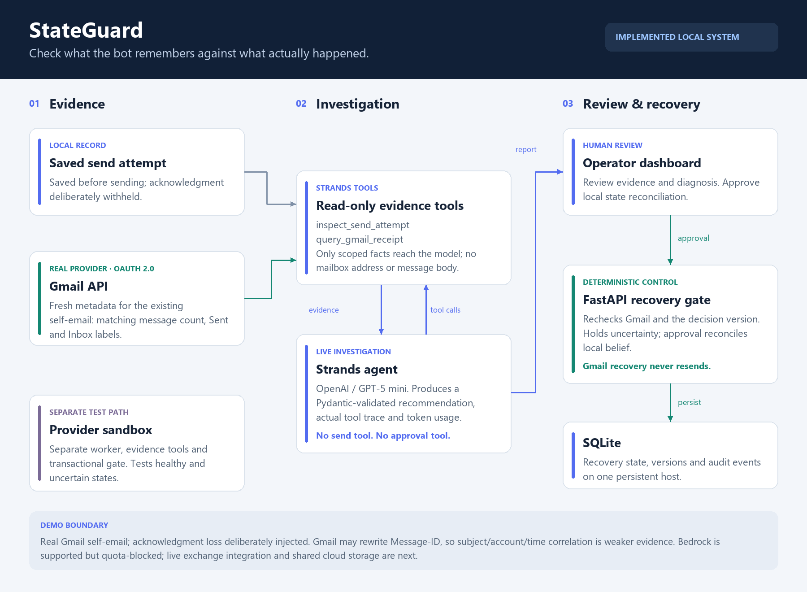

# StateGuard

> **AWS AI Challenge** — *Professional Agents Track*  
> **Live Cloud Demo**: [https://gzmrlkrayb3oz3qe22g2v5tv7e0qoqfa.lambda-url.us-east-1.on.aws/](https://gzmrlkrayb3oz3qe22g2v5tv7e0qoqfa.lambda-url.us-east-1.on.aws/)  
> **Interactive Architecture**: [https://gzmrlkrayb3oz3qe22g2v5tv7e0qoqfa.lambda-url.us-east-1.on.aws/architecture](https://gzmrlkrayb3oz3qe22g2v5tv7e0qoqfa.lambda-url.us-east-1.on.aws/architecture)

StateGuard prevents autonomous communication agents from retrying against stale delivery state. When external APIs experience acknowledgment timeouts, naive agents assume failure and double-send. StateGuard introduces a deterministic transactional action gate, queries fresh provider evidence using read-only Strands investigation tools, and requires versioned human approval before reconciling belief.

---

## Architecture

StateGuard implements two distinct, parallel evidence pipelines feeding an advisory AI investigation and deterministic human-in-the-loop recovery:



1. **Stateful Sandbox Worker (Primary Flow)**:
   * EventBridge invokes a background worker every minute (or via local polling).
   * The deterministic gate verifies the sandbox provider ledger before dispatching.
   * On delivery contradiction, the retry is held and a versioned incident is published.
   * Strands agent investigates using `inspect_worker_history` and `query_delivery_provider`.
2. **Real Gmail Recovery (Controlled Proof)**:
   * Evaluates an authorized, previously sent self-email where acknowledgment loss was simulated.
   * Read-only tools (`inspect_send_attempt` and `query_gmail_receipt`) inspect live Gmail API metadata via OAuth 2.0 without resend permissions.
3. **Deterministic Review & Recovery**:
   * Strands agent recommendations are strictly advisory (the agent has no send or approval tools).
   * Validated diagnoses are committed to versioned state (**DynamoDB** conditional writes on AWS / **SQLite** transactions locally).
   * The operator reviews evidence in the dashboard; approval reconciles local belief only after re-verifying current evidence against the expected state version.

For the formal architecture specification and Mermaid workflows, see [`docs/ARCHITECTURE.md`](docs/ARCHITECTURE.md).

---

## Executable Sandbox Walkthrough

The primary demo is an executable, stateful email-provider sandbox:

1. **Trigger timeout contradiction**: Select “Provider delivered, worker saw timeout” workflow.
2. **Run worker**: The background worker attempts processing. The provider ledger reflects that the message was already delivered; the action gate halts the duplicate retry.
3. **Investigate with Strands**: The agent executes both evidence tools, analyzes worker belief against provider reality, and returns a Pydantic-validated diagnosis with actual token usage and measured execution time.
4. **Approve reconciliation**: The operator authorizes reconciliation. The gate rechecks state versions, updates belief to `delivered`, and completes without duplicate sends.
5. **Explore state conditions**: Test healthy, pending, and unavailable provider states. Healthy workflows complete autonomously without approval; uncertain provider responses remain queued.

---

## Real Gmail Recovery (Controlled Experiment)

To validate behavior against a real production API, StateGuard includes a dedicated Gmail verification flow:

* Uses an authorized, pre-existing self-email sent to the authenticated account itself.
* Injects acknowledgment loss to simulate network timeout after provider acceptance.
* The dashboard loads the durable send claim, queries fresh Sent and Inbox metadata, and invokes Strands tools with scoped facts (no message bodies or recipient addresses are exposed to the model).
* Approving reconciliation updates local belief only; the system contains no mechanism to resend mail.
* See [`docs/gmail-live-verification.json`](docs/gmail-live-verification.json) for recorded run data.

---

## Quickstart & Local Setup

### 1. Installation

```bash
git clone https://github.com/mofeed28/stateguard.git
cd stateguard
python -m pip install -e ".[dev]"
```

### 2. Configure Environment

Create a `.env` file in the project root:

```ini
STATEGUARD_MODEL_PROVIDER=openai
STATEGUARD_USE_STRANDS_LLM=1
OPENAI_API_KEY=your_openai_api_key
STATEGUARD_LIVE_DEMO_KEY=choose_a_local_demo_key
```

### 3. Start the API Server

```bash
python -m uvicorn stateguard.app:app --app-dir backend --host 127.0.0.1 --port 8787
```

Open [http://127.0.0.1:8787](http://127.0.0.1:8787) in your browser.

### 4. Run the Autonomous Worker

In a separate terminal, launch the polling worker:

```bash
python -m stateguard.worker --interval 5
```

Alternatively, run the automated launch script:
```powershell
./scripts/start-local.ps1 -Live -Provider openai
```

---

## Model & Provider Support

StateGuard leverages the [Strands Agents SDK](https://github.com/strands-agents/strands) with bounded turns, structured Pydantic outputs, and explicit tool execution:

* **OpenAI (`gpt-5-mini`) [Verified Primary]**: The default model for deployed cloud and local investigations. Provides deterministic structured outputs and tool traces under low reasoning latency.
* **Amazon Bedrock (`us.amazon.nova-micro-v1:0`) [Supported Optional]**: Compatible via Strands BedrockModel with AWS SigV4 credentials. *(Note: OpenAI is used for the active AWS deployment due to account quota limits).*

Credentials are never embedded in frontend code. Cloud deployments fetch API tokens dynamically from **AWS Secrets Manager** via IAM execution roles.

---

## Demo Videos & Artifacts

* **Sandbox Investigation**: [`artifacts/demo/StateGuard-demo.mp4`](artifacts/demo/StateGuard-demo.mp4) (2:36 walkthrough of the core sandbox workflow, contradiction blocking, and live Strands investigation).
* **Gmail Recovery Walkthrough**: [`artifacts/gmail-demo/StateGuard-demo.mp4`](artifacts/gmail-demo/StateGuard-demo.mp4) (Narrated walkthrough of real Gmail metadata verification and versioned approval).

---

## Validation & Automated Testing

StateGuard is tested for concurrency safety, version validation, duplicate prevention, and redaction:

```bash
# Run unit and integration test suite
python -m pytest -q

# Run reproducible 4-scenario sandbox evaluation matrix
python scripts/evaluate.py
```

* Evaluation outputs and methodology: [`docs/evaluation.json`](docs/evaluation.json).
* Cloud deployment verification evidence: [`docs/aws-live-verification.json`](docs/aws-live-verification.json).

---

## Cloud Deployment Scope

The production deployment runs serverless on AWS:
* **Compute**: AWS Lambda (Python 3.11 with Mangum for FastAPI).
* **Persistence**: Amazon DynamoDB with conditional writes preventing concurrent retry races.
* **Scheduling**: Amazon EventBridge invokes the sandbox worker every minute.
* **Secrets**: AWS Secrets Manager manages provider API tokens and OAuth credentials.

Deployment procedures and cloud verification runbooks are documented in [`docs/DEPLOYMENT.md`](docs/DEPLOYMENT.md).

---

## License

MIT License. See [LICENSE](LICENSE) for details.
