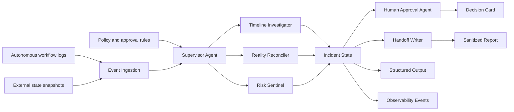

# Architecture

## Data Flow

1. Connectors submit planned actions, local belief snapshots, external observations, and provider responses.
2. The Supervisor Agent opens or updates an incident.
3. The Timeline Investigator orders causality across logs, fills, API responses, and websocket delays.
4. The Reality Reconciler checks expected state against observed state.
5. The Risk Sentinel assigns severity and recommends the safest next action.
6. The Human Approval Agent presents an approval card when intervention is needed.
7. The Handoff Writer produces a sanitized audit trail.
8. The API emits a Pydantic-validated structured decision object and production-style observability events.

## AWS Deployment Shape

- Amazon Bedrock or AgentCore hosts the Strands agents.
- Amazon EventBridge accepts workflow events from integrations.
- Amazon SQS buffers investigation jobs.
- Amazon DynamoDB stores incident state and replay data.
- Amazon ECS or AWS Lambda runs API and worker processes.
- Amazon CloudWatch collects operational telemetry.
- OpenTelemetry-style spans can map directly from the visible workflow trace and observability event stream.

## Strands SDK Mapping

- Custom tools: `load_incident_events`, `detect_state_mismatches`, `classify_automation_risk`, and `generate_sanitized_handoff`.
- Structured output: `StructuredInvestigationOutput` validates the approval decision, blocked actions, mismatch count, severity, and confidence.
- Multi-agent workflow: StateGuard passes the same incident through Supervisor, Timeline Investigator, Reality Reconciler, Risk Sentinel, Human Approval Agent, and Handoff Writer roles, then exposes that sequence as a visible workflow trace.
- Production operation: the API can run as an in-process FastAPI app locally, then move to AgentCore Runtime for AWS-hosted execution.
