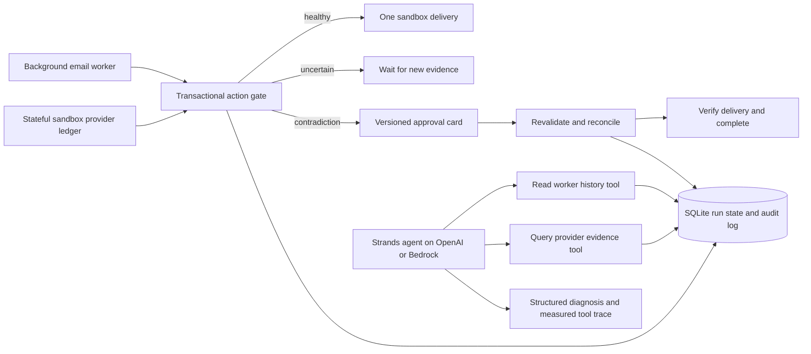

# StateGuard architecture

## Implemented now

`workflow.py` implements the sandbox state machine, provider ledger, atomic guard, approval checks, and live investigation. `worker.py` runs an independent background polling process. FastAPI exposes controls; the dashboard presents current state, real audit events, and optional model output.

Each run has a random identifier and independent state. These identifiers are demo capabilities, not a production authentication system. Approval records the expected version and permits reconciliation only; it never authorizes a resend. A provider change invalidates prior analysis and approval. The local SQLite transaction covers the sandbox evidence check and send; this atomicity does not automatically extend to an external API.

Live investigation uses a single Strands agent with two read-only evidence tools. It is not a six-agent system. The archived examples are deterministic illustrations. Pydantic validates actual live structured output. Tool output and elapsed time are recorded from execution, not synthesized.

## Required before production

Implement a real provider adapter with stable message IDs/idempotency, authenticated operator access, bounded retention, and shared durable storage. For AWS scaling, replace SQLite with conditional DynamoDB operations or another shared transactional store and enqueue worker jobs. AgentCore, EventBridge, SQS, and CloudWatch integrations remain future work. Lambda /tmp is unsuitable for shared durable state.

## Separate real-email experiment

The Gmail CLI persists a single send claim, sends one explicitly authorized self-email, injects acknowledgment loss, and checks Sent/Inbox evidence. It remains separate from the dashboard and agent tools. See the README for correlation limitations and safe rechecking.
