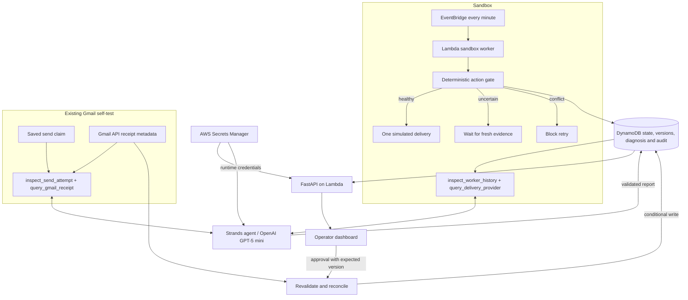

# StateGuard architecture

Two separate recovery paths persist evidence and diagnosis before the API presents them for human review. One Strands agent uses the matching pair of read-only tools per investigation.

## Execution and persistence

`workflow.py` owns the sandbox ledger and action gate. `worker.py` processes ready or waiting runs; EventBridge invokes it every minute on Lambda. Locally it runs as a separate process. New confirmed conflicts trigger live investigation when enabled. The worker never sends a real email.

`storage.py` uses conditional DynamoDB writes on AWS and SQLite transactions locally. Sandbox and Gmail records have separate namespaces. Concurrent cloud writers retry only pure state transitions after a revision conflict; they never retry an external send. Random run IDs and a shared demo key provide demo access control, not individual operator identity.

`gmail_recovery.py` reads the authorized self-email claim and fresh Gmail metadata. Approval rechecks the provider and expected state version. Dashboard and agent have no email send capability. Credentials come from Secrets Manager using the Lambda role; local development uses ignored files.

Reports contain Pydantic-validated output, actual tool calls, timing and token usage. They are advisory. The deterministic gate owns reconciliation. Reports pass through persisted state and the API before appearing in the dashboard.

## Demonstration limits

Acknowledgment loss is deliberately injected. Gmail rewrote the supplied Message-ID, so subject/account/time correlation is weaker than a stable provider ID. The one-message Sent-and-Inbox match proves receipt only for this self-test. Gmail reads and state writes are not one distributed transaction.

Sandbox atomicity does not guarantee exactly-once external effects. Production still needs provider idempotency, individual authentication, retention and resource limits. Bedrock is supported but quota-blocked in this account; deployed investigations use OpenAI. Live trading integration, SQS and AgentCore are not implemented.

## Diagram files

- `architecture-diagram.png`: Devpost upload.
- `architecture-diagram.svg`: editable vector.
- `architecture-diagram.html`: served at `/architecture`.

Regenerate with `python scripts/render_architecture.py` (Pillow and Windows Segoe UI fonts).
